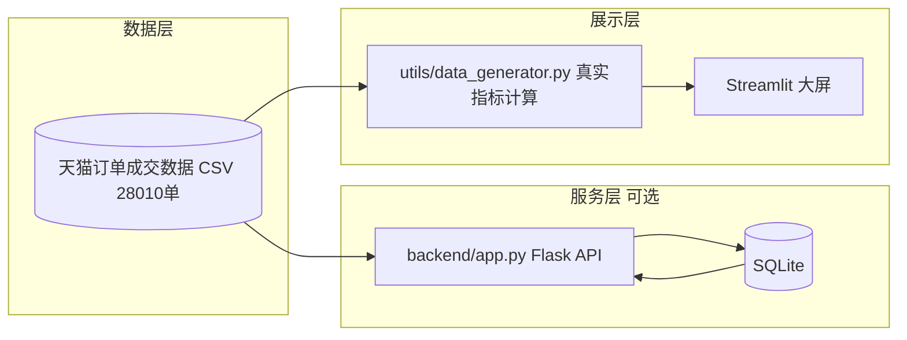

# 企业数据智能监控大屏（Enterprise BI Dashboard）

> 全栈 BI 数据可视化大屏 — 从**数据层 → 服务层 → 展示层**的完整链路，覆盖销售/订单/付款/退款/地域 5 大业务模块。

一个面向业务方与数据团队的**经营监控分析平台**：支持时间筛选、KPI 指标下钻、多维可视化、智能告警，并配套 Flask RESTful API 供前端复用。

> **数据真实性说明**：大屏所有指标均基于**真实公开电商订单数据**（天猫订单成交数据，天池公开数据集，28,010 单）实时计算，无任何模拟 / 合成数据。

---

## 核心功能

| 模块 | 说明 |
|------|------|
| **KPI 指标卡** | 6 大核心指标（销售额、订单量、客单价、付款率、退款率、覆盖省份）+ 真实日环比 |
| **指标下钻** | 点击任意 KPI 卡片 → 支持**时间 / 省份 / 订单状态**多维度下钻，带柱状图 + 明细表格 |
| **每日趋势** | 销售额 / 订单量 / 付款订单三指标每日曲线，支持 Tab 切换 |
| **维度拆解** | 全国订单地域分布、订单状态占比、省份销售 TOP10 |
| **智能告警** | 基于真实阈值判断（整体退款率、分省份退款率、未付款占比），分级 + 处理建议 |
| **每日交易健康度** | 付款率 / 退款率逐日趋势，直观反映交易质量 |
| **订单流水** | 真实订单抽样滚动展示 |
| **时间筛选** | 今日 / 昨日 / 本周 / 本月 / 自定义日期 |
| **自动刷新** | 侧边栏开关 + 间隔（2s/5s/10s/30s） |

---

## 系统架构



- **数据层**：`data/tmall_order_report.csv` — 真实天猫订单成交数据（天池公开数据集）。
- **指标计算层**：`utils/data_generator.py` 直接读取真实 CSV，计算 KPI、趋势、省份分布、订单状态、告警等，**无任何模拟数据**。
- **展示层**：`app.py` + `pages/` 三页 + API 文档页，读取 `data_generator` 提供的真实指标。
- **后端 API（可选）**：`backend/app.py` 为独立 Flask RESTful API，读取**同一份真实天猫订单 CSV**，经 Pandas 计算后写入本地 SQLite 并对外提供接口，演示前后端分离架构；与前端指标口径一致，同为真实数据。前端可独立运行、不依赖此后端。

---

## 技术栈

- **前端**：Python 3.11 + Streamlit（深色科技风 BI 大屏）
- **后端 API（可选）**：Flask 3.x + Flask-CORS
- **数据库**：SQLite（轻量内嵌，便于演示；架构支持平滑切换至 MySQL/PostgreSQL）
- **数据处理**：Pandas + NumPy
- **可视化**：Plotly
- **部署**：Streamlit Cloud / Docker / Gunicorn + Nginx

---

## 数据字典

| 文件 | 说明 |
|------|------|
| `data/tmall_order_report.csv` | 真实天猫订单成交数据（天池公开数据集），字段：订单编号、总金额、买家实际支付金额、收货地址、订单创建时间、订单付款时间、退款金额 |

### 指标口径（均基于真实订单计算）

| 指标 | 口径 |
|------|------|
| 销售额 | 买家实际支付金额求和（按日 / 按省份） |
| 订单量 | 订单总数 |
| 客单价 | 实际支付金额 / 已付款订单数 |
| 付款率 | 已付款订单 / 总订单 |
| 退款率 | 退款金额 > 0 的订单 / 总订单 |
| 覆盖省份 | 收货地址去重计数 |
| 订单状态 | 已付款 / 未付款 / 已退款（按付款时间、退款金额推导） |

> 数据来源：天猫订单成交数据（天池公开数据集，CC 协议可展示）。如需替换数据，将真实订单 CSV 按上述字段放入 `data/` 并修改 `data_generator.py` 的字段映射即可。

---

## 后端 API 接口（可选）

> 服务地址：`http://127.0.0.1:5000`，默认开启 CORS。

| 方法 | 路径 | 参数 | 说明 |
|------|------|------|------|
| GET | `/api/kpi` | `period=today\|week\|month` | KPI 汇总 + 环比 |
| GET | `/api/trend` | `date=YYYY-MM-DD` | 每日趋势 |
| GET | `/api/channel` | `date=YYYY-MM-DD` | 订单状态占比 |
| GET | `/api/top_products` | `date=YYYY-MM-DD` | 省份销售 TOP10 |
| GET | `/api/orders_stream` | `limit=20` | 订单流水 |

接口调用示例详见应用内 **API 文档** 页（`pages/api_docs.py`）。

---

## 本地运行

```bash
# 1. 安装依赖
pip install -r requirements.txt

# 2. 启动前端大屏（默认 http://localhost:8501）
streamlit run app.py

# 3.（可选）启动后端 API（默认 http://127.0.0.1:5000）
python backend/app.py
```

> 前端展示可不依赖后端 API 独立运行；API 用于演示前后端分离与时序复用。

---

## 文件结构

```
.
├── app.py                    # 监控总览（KPI + 时间筛选 + 下钻 + 多维分析）
├── pages/
│   ├── monitor.py            # 监控中心页
│   ├── alert.py              # 智能告警中心
│   └── api_docs.py           # Flask API 文档页
├── backend/
│   └── app.py                # Flask RESTful API（可选）
├── data/
│   └── tmall_order_report.csv  # 真实天猫订单成交数据（天池公开数据集）
├── utils/
│   ├── navbar.py             # 统一导航栏 + 主题
│   └── data_generator.py     # 数据读取层（真实 CSV → 指标计算）
├── requirements.txt
├── Dockerfile
└── README.md
```

