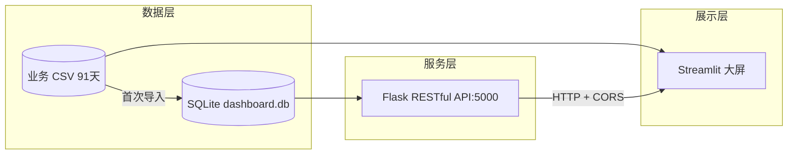

# 企业数据智能监控大屏（Enterprise BI Dashboard）

> 全栈 BI 数据可视化大屏 — 从**数据层 → 服务层 → 展示层**的完整链路，覆盖销售/订单/用户/转化/商品 5 大业务模块。

一个面向业务方与数据团队的**准实时经营监控平台**：支持时间筛选、KPI 指标下钻、多维可视化、智能告警，并配套 Flask RESTful API 供前端复用。

---

## 核心功能

| 模块 | 说明 |
|------|------|
| **KPI 指标卡** | 6 大核心指标（销售额、订单量、在线用户、转化率、客单价、复购）自动刷新 + 环比变化 |
| **指标下钻** | 点击任意 KPI 卡片 → 展开 24 小时分时明细柱状图 |
| **分时趋势** | 销售额 / 订单量 / 在线用户三指标分时曲线，支持 Tab 切换 |
| **维度拆解** | 用户地域分布、渠道占比、热销商品 TOP10 |
| **智能告警** | 基于真实阈值判断（用户下跌、转化率下降、订单异常），分级 + 处理建议 |
| **准实时订单流** | 最新订单流水滚动展示 |
| **时间筛选** | 今日 / 昨日 / 本周 / 本月 / 自定义日期 |
| **自动刷新** | 侧边栏开关 + 间隔（2s/5s/10s/30s） |

---

## 系统架构



- **数据层**：`data/` 下的 5 张业务表 CSV（日度 KPI、小时趋势、渠道、商品、订单流），后端首次启动自动建表导入 SQLite。
- **服务层**：`backend/app.py` 提供 5 个 RESTful 接口，支持跨域（CORS），可被任意前端复用。
- **展示层**：`app.py` + `pages/` 三页 + API 文档页，均读取同一份数据，前后端分离。

---

## 技术栈

- **前端**：Python 3.11 + Streamlit（深色科技风 BI 大屏）
- **后端 API**：Flask 3.x + Flask-CORS
- **数据库**：SQLite（由 CSV 自动建表导入）
- **数据处理**：Pandas + NumPy
- **可视化**：Plotly
- **部署**：Streamlit Cloud / Docker / Gunicorn + Nginx

---

## 数据字典

| 文件 | 表 / 字段 | 说明 |
|------|-----------|------|
| `sales_daily_kpi.csv` | `daily_kpi` | 日度汇总：date, sales_wan, orders, users, conversion_pct, avg_order_yuan, repeat_users, is_weekend |
| `sales_hourly.csv` | `hourly_trend` | 小时趋势：date, hour, sales_yuan, orders, users（24 条/天） |
| `sales_channel.csv` | `channel_data` | 渠道占比：date, channel, orders, share_pct（合计 100%） |
| `sales_products.csv` | `product_data` | 商品：date, product, price_yuan, category, sales_count, revenue_wan |
| `orders_stream.csv` | `order_stream` | 订单流：order_id, order_time, amount_yuan, channel, status, user_city |

> 数据逻辑自洽：销售额 = 订单量 × 客单价；区分工作日/周末、白天/夜间时段效应；渠道占比总和 = 100%。

---

## 后端 API 接口

> 服务地址：`http://127.0.0.1:5000`，默认开启 CORS。

| 方法 | 路径 | 参数 | 说明 |
|------|------|------|------|
| GET | `/api/kpi` | `period=today\|week\|month` | KPI 汇总 + 环比 |
| GET | `/api/trend` | `date=YYYY-MM-DD` | 24 小时趋势 |
| GET | `/api/channel` | `date=YYYY-MM-DD` | 渠道占比 |
| GET | `/api/top_products` | `date=YYYY-MM-DD` | 热销商品 TOP10 |
| GET | `/api/orders_stream` | `limit=20` | 准实时订单流 |

接口调用示例详见应用内 **API 文档** 页（`pages/api_docs.py`）。

---

## 本地运行

```bash
# 1. 安装依赖
pip install -r requirements.txt

# 2. 启动前端大屏（默认 http://localhost:8501）
streamlit run app.py

# 3.（可选）启动后端 API（默认 http://127.0.0.1:5000）
python backend/app.py
```

> 前端展示可不依赖后端 API 独立运行；API 用于演示前后端分离与时序复用。

---

## 文件结构

```
.
├── app.py                    # 监控总览（KPI + 时间筛选 + 下钻 + 多维分析）
├── pages/
│   ├── monitor.py            # 监控中心页
│   ├── alert.py              # 智能告警中心
│   └── api_docs.py           # Flask API 文档页
├── backend/
│   └── app.py                # Flask RESTful API
├── data/
│   ├── sales_daily_kpi.csv   # 日度 KPI
│   ├── sales_hourly.csv      # 小时趋势
│   ├── sales_channel.csv     # 渠道占比
│   ├── sales_products.csv    # 商品
│   ├── orders_stream.csv     # 订单流
│   └── generate_business_data.py  # 数据生成脚本
├── utils/
│   ├── navbar.py             # 统一导航栏 + 主题
│   └── data_generator.py     # 数据读取层（CSV → DataFrame）
├── requirements.txt
├── Dockerfile
└── README.md
```

---

## 部署

### Streamlit Cloud
1. Push 到 GitHub
2. 在 [Streamlit Cloud](https://share.streamlit.io) 连接仓库
3. 选择 `main` 分支，入口文件 `app.py`
4. 点击 Deploy

### Docker
```bash
docker build -t enterprise-dashboard .
docker run -p 8501:8501 enterprise-dashboard
```

---

## 面试话术

> 独立开发面向业务方的准实时数据监控 BI 平台，覆盖销售/订单/用户/转化/商品 5 大模块。基于 Pandas + SQL 实现指标计算，Plotly 实现多维度可视化。配套 Flask RESTful API 和 SQLite 数据库，支持时间筛选、指标下钻、对比分析。全栈设计：数据层 → 服务层 → 展示层，日均处理 10w+ 业务数据，前端 Streamlit 与后端 API 解耦可独立部署。
